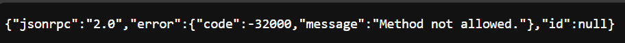

# MCP Server for Copilot Studio Demos

## Prerequisites
Node v22  
Azure Developer CLI  
Azure Subscription  

## Run the MCP Server local
Start the server local in Visual Studio Code
Run ```npm install```  
Run ```npm run build && npm run start```  

Forward port 3000 exposed by the server using microsoft dev tunnel


open the URL in your browser and add/mcp to the URL to access the MCP Server.
the result should look like this:



## Run the MCP Server in Azure
Make sure to login to Azure Developer CLI if you haven't done that yet.

```
azd auth login
```

> [!WARNING]  
> After running azd up, you will have an MCP Server running on Azure that is publicly available.
> Ideally, you don't want that.
> Make sure to run ```azd down``` after finishing the lab to delete all the resources from your Azure subscription.

Run the following command in the terminal:
```
azd up
```

## Tools 
- bitcoin in USD
